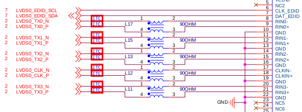
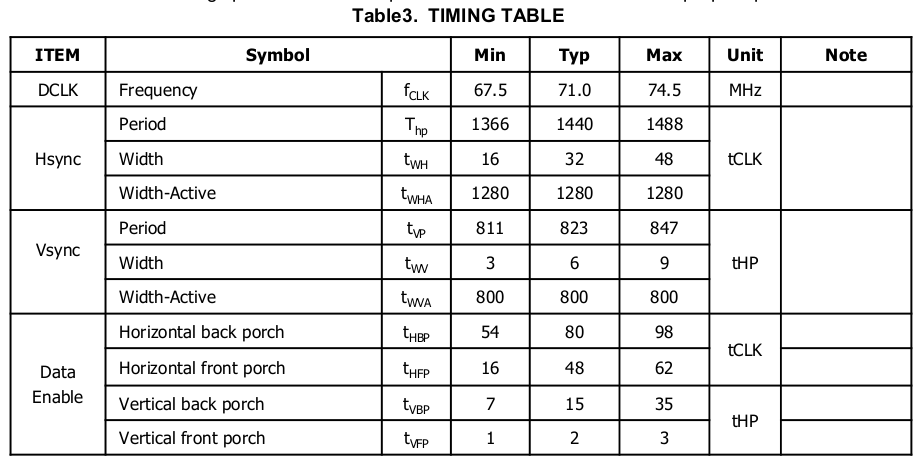
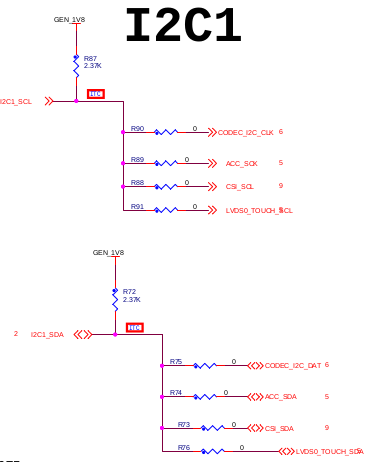
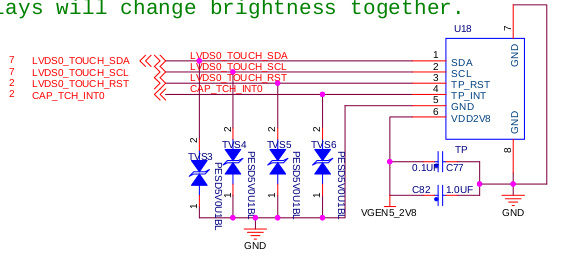
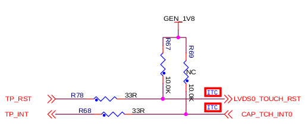
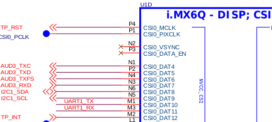

[LVDS](#LVDS_ID)  
[TouchPanel](#TP_ID)

##	LVDS <span id="LVDS_ID"></span>  
LVDS屏幕型号是LG的:10.1寸 WX TFT LCD LP101WX2  





DT中的配置如下图所示:

```c
&mxcfb1 {
	compatible = "fsl,mxc_sdc_fb";
	disp_dev = "ldb";
	interface_pix_fmt = "RGB24";
	mode_str ="1280x800M@60";
	default_bpp = <24>;
	int_clk = <0>;
	late_init = <0>;
	status = "ok";
};

&ldb {
	lvds-channel@0 {
		fsl,data-width = <24>;
		primary;
		display-timings {
			native-mode = <&indoor_lvds>;
			indoor_lvds: LP101WX2 {
				 clock-frequency = <60000000>;
				 hactive = <1280>;
				 vactive = <800>;
				 hback-porch = <48>;
				 hfront-porch = <80>;
				 vback-porch = <15>;
				 vfront-porch = <2>;
				 hsync-len = <32>;
				 vsync-len = <47>;
			 };
		};
	};
};
```


##	TouchPanel <span id="TP_ID"></span>  
TP型号是汇顶的:gt9xx  

[TP驱动代码](http://www.baidu.com)

DT配置如下图所示:

```c
&iomuxc {
	pinctrl_myts_int: gt9xx_int {
		fsl,pins = <MX6QDL_PAD_CSI0_DAT12__GPIO5_IO30 0x8820>;
	};

	pinctrl_myts_rst: gt9xx_rst {
		fsl,pins = <MX6QDL_PAD_CSI0_MCLK__GPIO5_IO19 0x8820>;
	};
};

&i2c1 {
	clock-frequency = <400000>;
	myts: gt9xx@14 {
		  compatible = "myts_gt9xx";
		  reg = <0x14>;
		  pinctrl-names = "int_pin", "rst_pin";
		  pinctrl-0 = <&pinctrl_myts_int>;
		  pinctrl-1 = <&pinctrl_myts_rst>;

		  interrupt-parent = <&gpio5>;
		  interrupts = <30 IRQ_TYPE_LEVEL_LOW>;

		  VDD-supply = <&vgen3_reg>;
		  gpios = <&gpio5 30 GPIO_ACTIVE_LOW
			  &gpio5 19 GPIO_ACTIVE_HIGH>;
	  };
};
```








