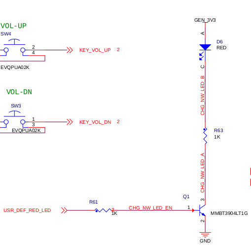
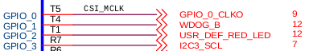

[ov5640_mipi](#OV5640_MIPI_ID)  
[myled](#MYLED_ID)  
[lan8720](#LAN8720_ID)  
[Codec](#CODEC_ID)  
[LVDS](#LVDS_ID)  
[TouchPanel](#TP_ID)  

##	ov5640_mipi <span id="OV5640_MIPI_ID"></span>  
在I2C1下添加DT配置如下  
```shell
ov564x_mipi: ov564x_mipi@3c {
	compatible = "ovti,ov564x_mipi";
	reg = <0x3c>;
	clocks = <&clks 201>;
	clock-names = "csi_mclk";
	DOVDD-supply = <&vgen4_reg>; /* 1.8v */
	AVDD-supply = <&vgen3_reg>;  /* 2.8v, rev C board is VGEN3
									rev B board is VGEN5 */
	DVDD-supply = <&vgen2_reg>;  /* 1.5v*/
	pwn-gpios = <&gpio1 19 1>;   /* active low: SD1_CLK */
	rst-gpios = <&gpio1 20 0>;   /* active high: SD1_DAT2 */
	csi_id = <1>;
	mclk = <24000000>;
	mclk_source = <0>;
};
```
[代码参考见https://github.com/54shady/KS/tree/master/codes](https://github.com/54shady/KS/tree/master/codes)

##	myled <span id="MYLED_ID"></span>  
一个简单的GPIO控制LED点灯的驱动,只是为了使用DT  
先看下原理图  



代码如下所示:

首先在DT的根下添加给驱动使用的节点  
其中包行要用到的GPIO,可由原理图看出来    
这里用的是无名GPIO所以在驱动里是按INDEX来访问的
```c
of_get_gpio(node, index);
```
```shell
/ {
	myled {
		compatible = "myled";
		gpios = <&gpio1 2 GPIO_ACTIVE_LOW>;
	};
};
```

或者是用有名GPIO来操作  
```shell
/ {
	myled {
		compatible = "myled";
		myled-gpios = <&gpio1 2 GPIO_ACTIVE_LOW>;
	};
};
```
驱动里用下面这个函数来获取  
```c
of_get_named_gpio(node, "myled-gpios", 0);
```

[代码参考见https://github.com/54shady/KS/tree/master/codes](https://github.com/54shady/KS/tree/master/codes)

##	Lan8720 <span id="LAN8720_ID"></span>  
[参考文章https://community.freescale.com/thread/360037](https://community.freescale.com/thread/360037).

需要修改时钟为50M  
DT配置如下  
```c
fec: ethernet@02188000 {
	compatible = "fsl,imx6q-fec";
	reg = <0x02188000 0x4000>;
	interrupts-extended =
		<&intc 0 118 IRQ_TYPE_LEVEL_HIGH>,
		<&intc 0 119 IRQ_TYPE_LEVEL_HIGH>;
	clocks = <&clks IMX6QDL_CLK_ENET>,
		   <&clks IMX6QDL_CLK_ENET>,
		   <&clks IMX6QDL_CLK_ENET_REF>;
	clock-names = "ipg", "ahb", "ptp";
	status = "disabled";
};

&fec {
	pinctrl-names = "default";
	pinctrl-0 = <&pinctrl_enet>;
	phy-mode = "rmii";
	phy-reset-gpios = <&gpio4 14 0>;
	phy-reset-duration = <2>;
	fsl,magic-packet;
	status = "okay";
};

pinctrl_enet: enetgrp {
	fsl,pins = <
		MX6QDL_PAD_ENET_MDC__ENET_MDC               0x1b0b0
		MX6QDL_PAD_ENET_MDIO__ENET_MDIO             0x1b0b0
		MX6QDL_PAD_ENET_CRS_DV__ENET_RX_EN          0x1b0b0
		MX6QDL_PAD_ENET_RXD0__ENET_RX_DATA0         0x1b0b0
		MX6QDL_PAD_ENET_RXD1__ENET_RX_DATA1         0x1b0b0
		MX6QDL_PAD_ENET_TX_EN__ENET_TX_EN           0x1b0b0
		MX6QDL_PAD_ENET_TXD0__ENET_TX_DATA0         0x1b0b0
		MX6QDL_PAD_ENET_TXD1__ENET_TX_DATA1         0x1b0b0
		MX6QDL_PAD_GPIO_16__ENET_REF_CLK            0x4001b0b0
		MX6QDL_PAD_ENET_RX_ER__ENET_RX_ER           0x1b0b0
		MX6QDL_PAD_KEY_COL4__GPIO4_IO14             0x80000000
		MX6QDL_PAD_GPIO_19__GPIO4_IO05             0x80000000
		>;
};

```
从下图中可以看出寄存器的起始地址和长度分别是  
0x2188000~0x218BFFF  
16KB=0x4000  
所以DT里配置reg就是依据这里  
reg = <0x02188000 0x4000>;  


##	Codec <span id="CODEC_ID"></span>  
调试过程中发现插入声卡播放声音很小  
插入耳机后声音大小确是正常的  
对比了原理图后发现原来是耳机检测管脚配置问题  


```c
sound {
	hp-det-gpios = <&gpio7 8 GPIO_ACTIVE_HIGH>;
};
```

##	LVDS <span id="LVDS_ID"></span>  
LVDS屏幕型号是LG的:10.1寸 WX TFT LCD LP101WX2  
LVDS相关资料见refs目录  
单路8bit LVDS接口，共4对差分数据线:  
RX0-和RX0＋，RX1-和RX1＋，RX2-和RX2＋，RX3-和RX3＋  
因每对差分数据线可以传输7bit数据，4对差分数据线可以传输4×7bit=28bit  
除R0～R7、G0～G7、B0～B7占去24bit，还剩下4bit，HS、VS、DE占3bit  
还空余1 bit(若HS、VS信号不传输，将空余3bit)  


DT中的配置如下图所示:

```c
&mxcfb1 {
	compatible = "fsl,mxc_sdc_fb";
	disp_dev = "ldb";
	interface_pix_fmt = "RGB24";
	mode_str ="1280x800M@60";
	default_bpp = <24>;
	int_clk = <0>;
	late_init = <0>;
	status = "ok";
};

&ldb {
	lvds-channel@0 {
		fsl,data-width = <24>;/*RGB24*/
		primary;
		display-timings {
			native-mode = <&indoor_lvds>;
			indoor_lvds: LP101WX2 {
				 clock-frequency = <60000000>;
				 hactive = <1280>;
				 vactive = <800>;
				 hback-porch = <48>;
				 hfront-porch = <80>;
				 vback-porch = <15>;
				 vfront-porch = <2>;
				 hsync-len = <32>;
				 vsync-len = <47>;
			 };
		};
	};
};
```


##	TouchPanel <span id="TP_ID"></span>  
TP型号是汇顶的:gt9xx  

[gt9xx驱动代码](https://github.com/54shady/KS/tree/master/codes)

DT配置如下图所示:

```c
&iomuxc {
	pinctrl_myts_int: gt9xx_int {
		fsl,pins = <MX6QDL_PAD_CSI0_DAT12__GPIO5_IO30 0x8820>;
	};

	pinctrl_myts_rst: gt9xx_rst {
		fsl,pins = <MX6QDL_PAD_CSI0_MCLK__GPIO5_IO19 0x8820>;
	};
};

	/*
	 fsl,pins config detial see doc fsl,imx6dl-pinctrl.txt under the refs directory
	 fsl,pins: two integers array, represents a group of pins mux and config
	 setting. The format is fsl,pins = <PIN_FUNC_ID CONFIG>, PIN_FUNC_ID is a
	 pin working on a specific function, CONFIG is the pad setting value like
	 pull-up for this pin. Please refer to imx6dl datasheet for the valid pad
	 config settings.
	*/

more detial see the imx6dl-pinfunc.h under the refs directory
#define MX6QDL_PAD_CSI0_DAT12__GPIO5_IO30           0x054 0x368 0x000 0x5 0x0
#define MX6QDL_PAD_CSI0_MCLK__GPIO5_IO19            0x090 0x3a4 0x000 0x5 0x0
```


```c
&i2c1 {
	clock-frequency = <400000>;
	myts: gt9xx@14 {
		  compatible = "myts_gt9xx";
		  reg = <0x14>;
		  pinctrl-names = "int_pin", "rst_pin";
		  pinctrl-0 = <&pinctrl_myts_int>;
		  pinctrl-1 = <&pinctrl_myts_rst>;

		  interrupt-parent = <&gpio5>;
		  interrupts = <30 IRQ_TYPE_LEVEL_LOW>;

		  VDD-supply = <&vgen3_reg>;
		  gpios = <&gpio5 30 GPIO_ACTIVE_LOW
			  &gpio5 19 GPIO_ACTIVE_HIGH>;
	  };
};
```


