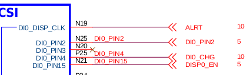

[EMMC](#EMMC_ID)  
[DDR](#ddr_id)  
[LCD LVDS LDB](#lcd_id)  
[FLASH UBOOT](#flash_uboot_ID)  
[V4L2 CALL FLOW](#V4L2_ID)  
[TS](#TS_ID)  
[CAMERA](#CAMERA_ID)  
[ANDROID](#android_id)
[MARKDONW](#markdown_id)  
[KGDB](#kgdb_id)  
[QEMU](#qemu_id)  
[KERNEL](#kernel_id)  
[UBOOT](#uboot_id)  
[MISC](#misc_id)  
[UBUNTU](#ubuntu_id)  
[MEMORY BARRIER](#memory_barrier_id)  
[FEC](#fec_id)  
[WIFI](#wifi_id)  
[IMX6](#imx6_id)

##	EMMC <span id="EMMC_ID"></span>

MX6SDL SABRESD U-Boot > mmc list            //表示该芯片有4个SD接口,如下原理图所示：
FSL_USDHC: 0  
FSL_USDHC: 1  
FSL_USDHC: 2  
FSL_USDHC: 3  

  
  

从原理图上可以知道，EMMC接到的是第四个接口上，所以要操作EMMC的话需要切换到相应的接口：  
MX6SDL SABRESD U-Boot > mmc dev 3    //UBOOT里从0开始计数  
mmc3(part 0) is current device  
  
MX6SDL SABRESD U-Boot > mmc part           //显示EMMC上的分区情况：  
Partition Map for UNKNOWN device 3  --   Partition Type: DOS  
Partition     Start Sector     Num Sectors     Type  
    1                16384           16384      83  
    2                32768           16384      83  
    3                49152         2211840       5 Extd  
    4              2260992        13090816      83  
    5                49153         1048575      83  
    6              1097729         1048575      83  
    7              2146305           16383      83  
    8              2162689           16383      83  
  
MX6SDL SABRESD U-Boot > mmcinfo            // 显示EMMC的信息：  
Device: FSL_USDHC  
Manufacturer ID: 45  
OEM: 100  
Name: SEM08  
Tran Speed: 25000000  
Rd Block Len: 512  
MMC version 4.0  
Clock: 52000000  
High Capacity: Yes  
Capacity: 7818182656 Bytes  
Bus Width: 8-bit DDR  
Current Partition for boot: Boot partition 1                //从这里可以知道启动分区是在第一个分区上  
  
所以要切换到启动分区的话：  
MX6SDL SABRESD U-Boot > mmc dev 3 1  
switch to partition #1, OK  
mmc3(part 1) is current device  
MX6SDL SABRESD U-Boot > mmc part       // 可以看到BOOT分区没有逻辑分区  
  
Partition Map for UNKNOWN device 3  --   Partition Type: DOS  
  
Partition     Start Sector     Num Sectors     Type  
bad MBR sector signature 0x0000  
  
在第一个分区才能看到有逻辑分区，可以知道这个分区应该是UDA分区：  
MX6SDL SABRESD U-Boot > mmc dev 3 0  
switch to partition #0, OK  
mmc3(part 0) is current device  

[参考文章http://blog.csdn.net/simonjay2007/article/details/43198353](http://blog.csdn.net/simonjay2007/article/details/43198353).

MX6SDL SABRESD U-Boot > mmc part  

Partition Map for UNKNOWN device 3  --   Partition Type: DOS  

Partition     Start Sector     Num Sectors     Type  
    1                16384           16384      83  
    2                32768           16384      83  
    3                49152         2211840       5 Extd  
    4              2260992        13090816      83  
    5                49153         1048575      83  
    6              1097729         1048575      83  
    7              2146305           16383      83  
    8              2162689           16383      83  


内核中看到的分区表信息  
major minor  #blocks  name  
 179        0    7634944 mmcblk0  
 179        1       8192 mmcblk0p1  
 179        2       8192 mmcblk0p2  
 179        3          1 mmcblk0p3  
 179        4    6504448 mmcblk0p4  
 179        5     524287 mmcblk0p5  
 179        6     524287 mmcblk0p6  
 179        7       8191 mmcblk0p7  
 259        0       8191 mmcblk0p8  
 179       16       2048 mmcblk0boot1  
 179        8       2048 mmcblk0boot0  

UBOOT里看到的分区表信息  
Partition     Start Sector     Num Sectors     Type  
    1                16384           16384      83  
    2                32768           16384      83  
    3                49152         2211840       5 Extd  
    4              2260992        13090816      83  
    5                49153         1048575      83  
    6              1097729         1048575      83  
    7              2146305           16383      83  
    8              2162689           16383      83  

分析烧写工具里脚本知道：boot.img烧写到了p1分区，对应UBOOT里的就是16384这个起始地址，转换为16进制就是4000  

    dd if=$FILE of=/dev/mmcblk0p1  

脚本里烧写IMX6DL ANDROID EMMC的内容:  

clean up u-boot parameter:  

    dd if=/dev/zero of=/dev/mmcblk0 bs=512 seek=1536 count=16

从这里知道参数存在偏移地址1536的地方,  
既后面的blk=1536的十六进制(600)，长度是16 * 512 = 2000(十六进制)  

先要切换到part 0  
MX6SDL SABRESD U-Boot > mmc dev 3 0  
switch to partition #0, OK  
mmc3(part 0) is current device  
读参数分区（确保参数都已经写入到EMMC中了）：  
*** Warning - bad CRC or MMC, using default environment    //说明参数分区没有写入EMMC中  
MX6SDL SABRESD U-Boot > save   //保存参数分区到EMMC中  

MX6SDL SABRESD U-Boot > mmc read 0x10800000 600 100      //这里最多读2000长度  
显示：
MX6SDL SABRESD U-Boot > md.b 0x10800000 100  
10800000: 71 de d3 09 62 6f 6f 74 64 65 6c 61 79 3d 33 00    q...bootdelay=3.  
10800010: 62 61 75 64 72 61 74 65 3d 31 31 35 32 30 30 00    baudrate=115200.  
10800020: 69 70 61 64 64 72 3d 31 39 32 2e 31 36 38 2e 31    ipaddr=192.168.1  
10800030: 2e 31 30 33 00 73 65 72 76 65 72 69 70 3d 31 39    .103.serverip=19  
10800040: 32 2e 31 36 38 2e 31 2e 31 30 31 00 6e 65 74 6d    2.168.1.101.netm  
10800050: 61 73 6b 3d 32 35 35 2e 32 35 35 2e 32 35 35 2e    ask=255.255.255.  
10800060: 30 00 6c 6f 61 64 61 64 64 72 3d 30 78 31 30 38    0.loadaddr=0x108  
10800070: 30 30 30 30 30 00 72 64 5f 6c 6f 61 64 61 64 64    00000.rd_loadadd  
10800080: 72 3d 30 78 31 31 30 30 30 30 30 30 00 6e 65 74    r=0x11000000.net  
10800090: 64 65 76 3d 65 74 68 30 00 65 74 68 70 72 69 6d    dev=eth0.ethprim  
108000a0: 65 3d 46 45 43 30 00 73 70 6c 61 73 68 69 6d 61    e=FEC0.splashima  
108000b0: 67 65 3d 30 78 33 30 30 30 30 30 30 30 00 73 70    ge=0x30000000.sp  
108000c0: 6c 61 73 68 70 6f 73 3d 6d 2c 6d 00 6c 76 64 73    lashpos=m,m.lvds  
108000d0: 5f 6e 75 6d 3d 31 00 62 6f 6f 74 61 72 67 73 3d    _num=1.bootargs=  
108000e0: 63 6f 6e 73 6f 6c 65 3d 74 74 79 6d 78 63 30 2c    console=ttymxc0,  
108000f0: 31 31 35 32 30 30 20 69 6e 69 74 3d 2f 69 6e 69    115200 init=/ini  

write U-Boot to sd card:

    dd if=$FILE of=/dev/mmcblk0 bs=512 seek=2 skip=2

跳过了前 2 * 512 字节 = 1024字节 既0x400  
切换到UBOOT的分区：为什么知道这个分区里烧的是UBOOT？  
MX6SDL SABRESD U-Boot > mmc bootpart  
Device 3: boot partition 1 is for boot    //从这个信息得到，大胆猜测 part 1就是bootloader  

切换到UBOOT的分区:  
MX6SDL SABRESD U-Boot > mmc dev 3 1  
switch to partition #1, OK  
mmc3(part 1) is current device  

读出UBOOT到DDR中：  
MX6SDL SABRESD U-Boot > mmc read 0x10800000 2 100  
显示读出的内容：  
MX6SDL SABRESD U-Boot > md.b 0x10800000 200  
10800000: d1 00 20 40 e0 06 80 27 00 00 00 00 2c 04 80 27    .. @...'....,..'  
10800010: 20 04 80 27 00 04 80 27 00 00 00 00 00 00 00 00     ..'...'........  
10800020: 00 00 80 27 58 f5 06 00 00 00 00 00 d2 02 a0 40    ...'X..........@  
10800030: cc 02 9c 04 02 0e 07 74 00 0c 00 00 02 0e 07 54    .......t.......T  
10800040: 00 00 00 00 02 0e 04 ac 00 00 00 30 02 0e 04 b0    ...........0....  
10800050: 00 00 00 30 02 0e 04 64 00 00 00 30 02 0e 04 90    ...0...d...0....  
10800060: 00 00 00 30 02 0e 07 4c 00 00 00 30 02 0e 04 94    ...0...L...0....  
10800070: 00 00 00 30 02 0e 04 a0 00 00 00 00 02 0e 04 b4    ...0............  
10800080: 00 00 00 30 02 0e 04 b8 00 00 00 30 02 0e 07 6c    ...0.......0...l  
10800090: 00 00 00 30 02 0e 07 50 00 02 00 00 02 0e 04 bc    ...0...P........  
108000a0: 00 00 00 30 02 0e 04 c0 00 00 00 30 02 0e 04 c4    ...0.......0....  
108000b0: 00 00 00 30 02 0e 04 c8 00 00 00 30 02 0e 04 cc    ...0.......0....  
108000c0: 00 00 00 30 02 0e 04 d0 00 00 00 30 02 0e 04 d4    ...0.......0....  
108000d0: 00 00 00 30 02 0e 04 d8 00 00 00 30 02 0e 07 60    ...0.......0...`  
108000e0: 00 02 00 00 02 0e 07 64 00 00 00 30 02 0e 07 70    .......d...0...p  
108000f0: 00 00 00 30 02 0e 07 78 00 00 00 30 02 0e 07 7c    ...0...x...0...|  
10800100: 00 00 00 30 02 0e 07 80 00 00 00 30 02 0e 07 84    ...0.......0....  
10800110: 00 00 00 30 02 0e 07 8c 00 00 00 30 02 0e 07 48    ...0.......0...H  
10800120: 00 00 00 30 02 0e 04 70 00 00 00 30 02 0e 04 74    ...0...p...0...t  
10800130: 00 00 00 30 02 0e 04 78 00 00 00 30 02 0e 04 7c    ...0...x...0...|  
10800140: 00 00 00 30 02 0e 04 80 00 00 00 30 02 0e 04 84    ...0.......0....  
10800150: 00 00 00 30 02 0e 04 88 00 00 00 30 02 0e 04 8c    ...0.......0....  
10800160: 00 00 00 30 02 1b 08 00 a1 39 00 03 02 1b 08 0c    ...0.....9......  
10800170: 00 1f 00 1f 02 1b 08 10 00 1f 00 1f 02 1b 48 0c    ..............H.  
10800180: 00 1f 00 1f 02 1b 48 10 00 1f 00 1f 02 1b 08 3c    ......H........<  
10800190: 42 48 02 48 02 1b 08 40 02 11 02 0b 02 1b 48 3c    BH.H...@......H<  
108001a0: 41 7f 02 11 02 1b 48 40 01 5d 01 66 02 1b 08 48    A.....H@.].f...H  
108001b0: 4b 4c 50 4d 02 1b 48 48 49 4c 4f 48 02 1b 08 50    KLPM..HHILOH...P  
108001c0: 3f 3f 2e 31 02 1b 48 50 2b 35 38 2b 02 1b 08 1c    ??.1..HP+58+....  
108001d0: 33 33 33 33 02 1b 08 20 33 33 33 33 02 1b 08 24    3333... 3333...$  
108001e0: 33 33 33 33 02 1b 08 28 33 33 33 33 02 1b 48 1c    3333...(3333..H.  
108001f0: 33 33 33 33 02 1b 48 20 33 33 33 33 02 1b 48 24    3333..H 3333..H$  

对比烧写的镜像文件,这里有点要注意的是,我们烧写的时候是跳过了镜像文件的前skip * 512字节的  
也就是跳过了u-boot-6dl.bin的前0x400字节，所以要从u-boot-6dl.bin文件的0x400开始对比：  
发现有段数据不一致？目前不知道为什么？从0x590开始才一样   //这里目前有个疑点  

0000400: 3f00 2040 3f06 3f27 0000 0000 2c04 3f27  ?. @?.?'....,.?'  
0000410: 2004 3f27 0004 3f27 0000 0000 0000 0000   .?'..?'........  
0000420: 0000 3f27 583f 0600 0000 0000 3f02 3f40  ..?'X?......?.?@  
0000430: 3f02 3f04 020e 0774 000c 0000 020e 0754  ?.?....t.......T  
0000440: 0000 0000 020e 043f 0000 0030 020e 043f  .......?...0...?  
0000450: 0000 0030 020e 0464 0000 0030 020e 043f  ...0...d...0...?  
0000460: 0000 0030 020e 074c 0000 0030 020e 043f  ...0...L...0...?  
0000470: 0000 0030 020e 043f 0000 0000 020e 043f  ...0...?.......?  
0000480: 0000 0030 020e 043f 0000 0030 020e 076c  ...0...?...0...l  
0000490: 0000 0030 020e 0750 0002 0000 020e 043f  ...0...P.......?  
00004a0: 0000 0030 020e 043f 0000 0030 020e 043f  ...0...?...0...?  
00004b0: 0000 0030 020e 043f 0000 0030 020e 043f  ...0...?...0...?  
00004c0: 0000 0030 020e 043f 0000 0030 020e 043f  ...0...?...0...?  
00004d0: 0000 0030 020e 043f 0000 0030 020e 0760  ...0...?...0...`  
00004e0: 0002 0000 020e 0764 0000 0030 020e 0770  .......d...0...p  
00004f0: 0000 0030 020e 0778 0000 0030 020e 077c  ...0...x...0...|  
0000500: 0000 0030 020e 073f 0000 0030 020e 073f  ...0...?...0...?  
0000510: 0000 0030 020e 073f 0000 0030 020e 0748  ...0...?...0...H  
0000520: 0000 0030 020e 0470 0000 0030 020e 0474  ...0...p...0...t  
0000530: 0000 0030 020e 0478 0000 0030 020e 047c  ...0...x...0...|  
0000540: 0000 0030 020e 043f 0000 0030 020e 043f  ...0...?...0...?  
0000550: 0000 0030 020e 043f 0000 0030 020e 043f  ...0...?...0...?  
0000560: 0000 0030 021b 0800 3f39 0003 021b 080c  ...0....?9......  
0000570: 001f 001f 021b 0810 001f 001f 021b 480c  ..............H.  
0000580: 001f 001f 021b 4810 001f 001f 021b 083c  ......H........<  
0000590: 4248 0248 021b 0840 0211 020b 021b 483c  BH.H...@......H<  
00005a0: 417f 0211 021b 4840 015d 0166 021b 0848  A.....H@.].f...H  
00005b0: 4b4c 504d 021b 4848 494c 4f48 021b 0850  KLPM..HHILOH...P  
00005c0: 3f3f 2e31 021b 4850 2b35 382b 021b 081c  ??.1..HP+58+....  
00005d0: 3333 3333 021b 0820 3333 3333 021b 0824  3333... 3333...$  
00005e0: 3333 3333 021b 0828 3333 3333 021b 481c  3333...(3333..H.  
00005f0: 3333 3333 021b 4820 3333 3333 021b 4824  3333..H 3333..H$  


write boot.img:
dd if=$FILE of=/dev/mmcblk0p1
从烧写脚本里可以知道boot.img是烧写到part 1
所以在UBOOT里的操作是：
先切换到eMMC对应的槽位MMC3:
mmc dev 3

boot.img的偏移量是根据 1                16384           16384      83 里 16384 的十六进制0x4000得来的
读出boot.img前0x2000 * 512字节到DDR 0x10800000的地方
mmc read 0x10800000 4000 2000

查看DDR地址0x10800000的内容
md.b 0x10800000 2000
MX6SDL SABRESD U-Boot > md.b 0x10800000 2000
10800000: 41 4e 44 52 4f 49 44 21 10 78 48 00 00 80 80 10    ANDROID!.xH.....  
10800010: 7f a1 03 00 00 00 80 11 00 00 00 00 00 00 70 11    ..............p.  
10800020: 00 01 80 10 00 08 00 00 00 00 00 00 00 00 00 00    ................  
10800030: 00 00 00 00 00 00 00 00 00 00 00 00 00 00 00 00    ................  
10800040: 63 6f 6e 73 6f 6c 65 3d 74 74 79 6d 78 63 30 2c    console=ttymxc0,  
10800050: 31 31 35 32 30 30 20 69 6e 69 74 3d 2f 69 6e 69    115200 init=/ini  
10800060: 74 20 76 69 64 65 6f 3d 6d 78 63 66 62 30 3a 64    t video=mxcfb0:d  
10800070: 65 76 3d 6c 64 62 2c 62 70 70 3d 33 32 20 76 69    ev=ldb,bpp=32 vi  
10800080: 64 65 6f 3d 6d 78 63 66 62 31 3a 6f 66 66 20 76    deo=mxcfb1:off v  
10800090: 69 64 65 6f 3d 6d 78 63 66 62 32 3a 6f 66 66 20    ideo=mxcfb2:off  
108000a0: 66 62 6d 65 6d 3d 31 30 4d 20 66 62 30 62 61 73    fbmem=10M fb0bas  
108000b0: 65 3d 30 78 32 37 62 30 30 30 30 30 20 76 6d 61    e=0x27b00000 vma  
108000c0: 6c 6c 6f 63 3d 34 30 30 4d 20 61 6e 64 72 6f 69    lloc=400M androi  
108000d0: 64 62 6f 6f 74 2e 63 6f 6e 73 6f 6c 65 3d 74 74    dboot.console=tt  
108000e0: 79 6d 78 63 30 20 61 6e 64 72 6f 69 64 62 6f 6f    ymxc0 androidboo  
108000f0: 74 2e 68 61 72 64 77 61 72 65 3d 66 72 65 65 73    t.hardware=frees  
10800100: 63 61 6c 65 00 00 00 00 00 00 00 00 00 00 00 00    cale............  


打开我没烧写的boot.img文件对比下：
0000000: 414e 4452 4f49 4421 1078 4800 003f 3f10  ANDROID!.xH..??.  
0000010: 7f3f 0300 0000 3f11 0000 0000 0000 7011  .?....?.......p.  
0000020: 0001 3f10 0008 0000 0000 0000 0000 0000  ..?.............  
0000030: 0000 0000 0000 0000 0000 0000 0000 0000  ................  
0000040: 636f 6e73 6f6c 653d 7474 796d 7863 302c  console=ttymxc0,  
0000050: 3131 3532 3030 2069 6e69 743d 2f69 6e69  115200 init=/ini  
0000060: 7420 7669 6465 6f3d 6d78 6366 6230 3a64  t video=mxcfb0:d  
0000070: 6576 3d6c 6462 2c62 7070 3d33 3220 7669  ev=ldb,bpp=32 vi  
0000080: 6465 6f3d 6d78 6366 6231 3a6f 6666 2076  deo=mxcfb1:off v  
0000090: 6964 656f 3d6d 7863 6662 323a 6f66 6620  ideo=mxcfb2:off  
00000a0: 6662 6d65 6d3d 3130 4d20 6662 3062 6173  fbmem=10M fb0bas  
00000b0: 653d 3078 3237 6230 3030 3030 2076 6d61  e=0x27b00000 vma  
00000c0: 6c6c 6f63 3d34 3030 4d20 616e 6472 6f69  lloc=400M androi  
00000d0: 6462 6f6f 742e 636f 6e73 6f6c 653d 7474  dboot.console=tt  
00000e0: 796d 7863 3020 616e 6472 6f69 6462 6f6f  ymxc0 androidboo  
00000f0: 742e 6861 7264 7761 7265 3d66 7265 6573  t.hardware=frees  
0000100: 6361 6c65 0000 0000 0000 0000 0000 0000  cale............  


Sending and writting system.img:  
pipe dd of=/dev/mmcblk0p5 bs=512\" file=\"files/android/system.img  

根据上面的信息可以知道system.img烧写到滴5个分区  
根据UBOOT里查看到的分区信息 ：5                49153         1048575      83   可以知道第五个分区的偏移量是 49153  对应的十六进制就是  C001  
所以切换到system所在分区：  
MX6SDL SABRESD U-Boot > mmc dev 3 4  
读到DDR中：  
MX6SDL SABRESD U-Boot >  mmc read 0x10800000 C001 200  
在UBOOT中显示：  
MX6SDL SABRESD U-Boot > md.b 0x10800000 2000  
截取一段有数据的比对下：在DDR地址400的地方开始有数据  


打开system.img也是在相同地址有相同的数据  


 Android fstab file.  
<src>     <mnt_point>     <type>    <mnt_flags and options>          <fs_mgr_flags>  
 The filesystem that contains the filesystem checker binary (typically /system) cannot  
 specify MF_CHECK, and must come before any filesystems that do specify MF_CHECK  
  
/devices/platform/sdhci-esdhc-imx.1/mmc_host/mmc2 /mnt/extsd vfat defaults voldmanaged=sdcard:auto      //SDCARD  
/devices/platform/fsl-ehci /mnt/udisk vfat defaults voldmanaged=sdcard:auto                             //UDISK  
/dev/block/mmcblk0p5    /system      ext4    ro                                                                wait  
/dev/block/mmcblk0p4    /data        ext4    nosuid,nodev,nodiratime,noatime,nomblk_io_submit,noauto_da_alloc,errors=panic   wait,encryptable=footer  
/dev/block/mmcblk0p6    /cache       ext4    nosuid,nodev,nomblk_io_submit                                             wait  
/dev/block/mmcblk0p7    /device      ext4    ro,nosuid,nodev                                                           wait  
/dev/block/mmcblk0p1    /boot        emmc    defaults                                                                defaults  
/dev/block/mmcblk0p2    /recovery    emmc    defaults                                                                defaults  
/dev/block/mmcblk0p8    /misc        emmc    defaults                                                                defaults  

###MMC TEST  
root@sabresd_6dq:/ # ./autorun-mmc-fdisk.sh  
Checking for devnode: /dev/block/mmcblk0  
autorun-mmc-fdisk.sh: PASS devnode found: /dev/block/mmcblk0  

fdisk: WARNING: rereading partition table failed, kernel still uses old table: Device or resource busy  
MMC test passes  

autorun-mmc-fdisk.sh: Exiting PASS  

root@sabresd_6dq:/ # ./autorun-mmc-blockrw.sh                                   
Checking for devnode: /dev/block/mmcblk0p6  
autorun-mmc-blockrw.sh: PASS devnode found: /dev/block/mmcblk0p6  

5+0 records in  
5+0 records out  
MMC test passes  

autorun-mmc-blockrw.sh: Exiting PASS  

root@sabresd_6dq:/ # ./autorun-mmc.sh                                           
Checking for devnode: /dev/block/mmcblk0p6  
autorun-mmc.sh: PASS devnode found: /dev/block/mmcblk0p6  
  
10240+0 records in  
10240+0 records out  
5242880 bytes transferred in 3.837 secs (1366400 bytes/sec)  
10240+0 records in  
10240+0 records out  
5242880 bytes transferred in 0.073 secs (71820273 bytes/sec)  
10240+0 records in  
10240+0 records out  
5242880 bytes transferred in 0.072 secs (72817777 bytes/sec)  
MMC test passes  

autorun-mmc.sh: Exiting PASS  

cat autorun-mmc.sh  
```shell
#!/system/bin/sh  
 
source /test-utils.sh  
 
#  
# Exit status is 0 for PASS, nonzero for FAIL  
#  
STATUS=0  
  
run_mmc_case()  
{  
    # Generate Test data  
    dd if=/dev/urandom of=/mmc_data bs=512 count=10240  
  
    dd if=/mmc_data of=/dev/block/mmcblk0p6 bs=512 count=10240  
    dd if=/dev/block/mmcblk0p6 of=/mmc_data1 bs=512 count=10240  
  
    cmp /mmc_data1 /mmc_data  
  
    if [ "$?" = 0 ]; then  
        printf "MMC test passes \n\n"  
        rm /mmc_data  
        rm /mmc_data1  
    else  
        STATUS=1  
        printf "MMC test fails \n\n"  
    fi  
}  
  
# devnode test  
check_devnode "/dev/block/mmcblk0p6"  
  
if [ "$STATUS" = 0 ]; then  
    run_mmc_case  
fi  
  
print_status  
exit $STATUS  
```

##	Flash Uboot <span id="flash_uboot_ID"></span>  

方法1使用dd  
进入系统后:  
一：UBOOT的烧写  

1. 使能EMMC写操作:

        echo 0 > /sys/block/mmcblk0boot0/force_ro

2. 烧写u-boot://不能少了skip=2参数

        dd if=u-boot.bin of=/dev/block/mmcblk0boot0 bs=512 seek=2 skip=2;sync

二：BOOT.IMG的烧写  
烧写boot.img  

    dd if=boot.img of=/dev/block/mmcblk0p1;sync  

方法2使用mmc write  
可先做个试验：  
1.先切换到bootloader分区

    mmc dev 3 1

2.把emmc里的uboot读出来到DDR 10000000 的地方

    mmc read 10000000 2 381

这里的381是通过下载的时候算的

3.在把uboot下载到中

loady  //通过串口发送过去  默认地址是10800000

比较下下载的和读出来的：

    cmp.b 10000000 10800400 381

其中我们跳过了下载的时候前0x400（1KB）的大小,只有这样比对发现才是一样的  

所以要想正确下载uboot到emmc里的话：  

    mmc write 10800400 2 381

解释下:  
   	10800400:	我们用loady 把uboot下载到（默认）地址是10800000  
		我们烧写的时候跳过了uboot的前1KB的大小  
 	2:	表示我们跳过emmc里的前1KB大小  
    318:	是我下载的时候看到的UBOOT的大小算出来的    
用loady下载uboot到DDR中，默认下载地址是环境变量指定的，可以手工指定  
  
MX6SDL SABRESD U-Boot > loady  
## Ready for binary (ymodem) download to 0x10800000 at 115200 bps...  
C  
Starting ymodem transfer.  Press Ctrl+C to cancel.  
  100%     448 KB    3 KB/s 00:02:01       0 Errors  
  
xyzModem - CRC mode, 3594(SOH)/0(STX)/0(CAN) packets, 3 retries  
## Total Size      = 0x00070388 = 459656 Bytes       //最总的大小是 459656 Byte = 897 * 512 Byte = 897个cnt 默认 1个cnt 是512 Byte, 897 == 0x381 (十进制转十六进制)  

有下表可以知道bootloader位于1KB的偏移量开始的地方 1KB = 1024Byte = 2blk  默认1个blk事512Byte  
所以读u-boot 是mmc read 10800000 2 100  这里的2是这么算出来的  
  
对于为什么要跳过这前1KB的大小，从文档中看是预留给MBR使用的:  
keep the first 512bytes 做为MBR使用，所以这里预留了前1KB  
  

## DDR <span id="ddr_id"></span>  
从下面的memory map 可以看出DDR的起始地址由DDR Memory Map Config配置决定：  

下图可以看到如果是从EMMC启动的话这个配置是看寄存器BOOT_CFG3的值：  
  
上面这个启动模式的寄存器的值地址是0x20d8004：  
  
进入系统后用memtool查看BOOT_CFG3 是0 所以DDR的起始地址就是第一张图里的1000_0000：  
root@sabresd_6dq:/ # memtool SRC.SBMR1                                          
SOC is mx6dl  

SRC      Addr:0x20d8000  
  SRC.SBMR1 Addr:0x020D8004 Value:0x00005860 - The Boot Mode register (SBMR) contains bits that reflect the status of Boot Mode Pins of the chip.  
     SRC.SBMR1.BOOT_CFG1(0..7)  :0x60  
             Please refer to fuse map.  
     SRC.SBMR1.BOOT_CFG2(8..15)         :0x58  
             Please refer to fuse map.  
     SRC.SBMR1.BOOT_CFG3(16..23)        :0x0  
             Please refer to fuse map.  
     SRC.SBMR1.BOOT_CFG4(24..31)        :0x0  
             Please refer to fuse map.  
  
现在用的板的DDR大小是1G的,即0x40000000：  
所以DDR的映射地址是从1000_0000 到 4fff_ffff的地址空间  


## LCD LVDS LDB <span id="lcd_id"></span>

###LVDS 
root@sabresd_6dq:/ # find -name "\*disp_dev\*"                                   
./sys/devices/platform/mxc_sdc_fb.0/graphics/fb0/fsl_disp_dev_property            //ldb            //BG  
./sys/devices/platform/mxc_sdc_fb.0/graphics/fb1/fsl_disp_dev_property            //overlay    //FG  
"ldb=spl0/1"  split mode on DI0/1   
"ldb=dul0/1"  dual mode on DI0/1    
"ldb=sin0/1"  single mode on LVDS0/1   
"ldb=sep0/1"  separate mode begin from LVDS0/1   
there are two LVDS channels(LVDS0 and LVDS1) which can transfer video  
datas, there two channels can be used as split/dual/single/separate mode.  
split mode means display data from DI0 or DI1 will send to both channels  
LVDS0+LVDS1.  
dual mode means display data from DI0 or DI1 will be duplicated on LVDS0  
and LVDS1, it said, LVDS0 and LVDS1 has the same content.  
single mode means only work for DI0/DI1->LVDS0 or DI0/DI1->LVDS1.  
separate mode means you can make DI0/DI1->LVDS0 and DI0/DI1->LVDS1 work  
at the same time.  

## TS <span id="TS_ID"></span>

### goodix

## CAMERA <span id="CAMERA_ID"></span>

###		V4L2 ioctl call flow <span id="V4L2_ID"></span>
```c
		ret_fast_syscall
			sys_ioctl
				do_vfs_ioctl

v4l2_ioctl//v4l2-dev.c
	video_usercopy//v4l2-ioctl.c
		mxc_v4l_do_ioctl(struct file *file, //mxc_v4l2_capture.c
			mxc_v4l2_s_ctrl(cam_data *cam, struct v4l2_control *c) //mxc_v4l2_capture.c
				vidioc_int_s_ctrl(cam->sensor, c); //mxc_v4l2_capture.c
					v4l2_int_ioctl_0(vidioc_int_s_ctrl_num)//v4l2-int-device.c
						/* Adapted from search_extable in extable.c. */
						find_ioctl(d->u.slave, cmd, (v4l2_int_ioctl_func *)no_such_ioctl_0))(d);//ov5640_mipi.c
						while (first <= last) {
							const struct v4l2_int_ioctl_desc *mid;
							mid = (last - first) / 2 + first;
							if (mid->num < cmd)
								first = mid + 1;
							else if (mid->num > cmd)
								last = mid - 1;
							else
								return mid->func;
						}
```

###V4L2 TEST  
FSL-UT-V4L2-003:  
overlay模式测试(overlay直接由CAMERA到LCD不经过CPU)：  
mxc_v4l2_overlay.out -iw 640 -ih 480 -it 0 -il 0 -ow 160 -oh 160 -ot 20 -ol 20 -r 0 -t 50 -do 0 -fg -fr 30  
  
调整输出为640X480：  
mxc_v4l2_overlay.out -iw 640 -ih 480 -it 0 -il 0 -ow 640 -oh 480 -ot 20 -ol 20 -r 0 -t 50 -do 0 -fg -fr 30  
  
调整输出为1024X768：  
mxc_v4l2_overlay.out -iw 640 -ih 480 -it 0 -il 0 -ow 1024 -oh 768 -ot 20 -ol 20 -r 0 -t 50 -do 0 -fg -fr 30  
  
FSL-UT-V4L2-006  
TV-Out test:  
./mxc_v4l2_output.out -iw 320 -ih 240 -ow 720 -oh 576  
/mxc_v4l2_output.out -iw 320 -ih 240 -ow 12800 -oh 800     全屏输出  
  
FSL-UT-V4L2-008   // 详细请参考该文档  
MIPI CSI preview:  
mxc_v4l2_overlay.out -iw 640 -ih 480 -ow 640 -oh 480 -m 0 -di /dev/video1 -fg  
  
FSL-UT-V4L2-009  // 详细请参考该文档  
MIPI CSI Capture:  
  
使用下面的命令来测试：采集视频和播放视频  
mxc_v4l2_capture.out -iw 2592 -ih 1944 -ow 640 -oh 480 -m 6 -r 0 -c 50 -fr 15 -d /dev/video1 test.yuv  
mxc_v4l2_output.out -iw 640 -ih 480 -ow 640 -oh 480 -r 0 -fr 30 test.yuv  

## AUDIO

### TINY ALSA  
[参考文章:http://blog.csdn.net/kangear/article/details/38139669](http://blog.csdn.net/kangear/article/details/38139669)

1.编译tinyalsa配套工具

$ mmm external/tinyalsa/

编译完后会产生tinyplay/tinymix/tinycap等等工具。  
tinymix: 查看配置混音器  
tinyplay: 播放音频  
tinycap: 录音  
 
2.查看当前系统的声卡  
[python] view plaincopy在CODE上查看代码片派生到我的代码片  
    root@android:/ # cat /proc/asound/cards  
     0 [RKRK616        ]: RK_RK616 - RK_RK616  
                          RK_RK616  
     1 [ROCKCHIPSPDIF  ]: ROCKCHIP-SPDIF - ROCKCHIP-SPDIF  
                          ROCKCHIP-SPDIF  
    root@android:/ #

3.tinymix查看混响器

tinymix使用方法a.不加任何参数-显示当前配置情况 b.tinymix [ctrl id] [var]不加[var]可以查看该[ctrl id]可选选项。  
[python] view plaincopy在CODE上查看代码片派生到我的代码片  

    root@android:/ # tinymix    
    Number of controls: 7    
    ctl type    num name                                     value    
    0   ENUM    1   Playback Path                            OFF    
    1   ENUM    1   Capture MIC Path                         MIC OFF    
    2   ENUM    1   Voice Call Path                          OFF    
    3   ENUM    1   Voip Path                                OFF    
    4   INT 2   Speaker Playback Volume                  0 0    
    5   INT 2   Headphone Playback Volume                0 0    
    6   ENUM    1   Modem Input Enable                       ON    

例：将输出切换到扬声器

root@android:/ # tinymix 0 SPK

关于tinymix小结：

通过观察发现，Android系统的声音音量的调节并没有直接使用tinyalsa，而基于上层软件实现，因为无论上层音量怎么改变，这里看到的都是24（以我采用的设备为例）。通道的切换是真正使用了tinyalsa，当通过不同通道播放音乐的时候可以实时观察到通道的切换。在某个网站上看到Android在没有声音播放的3秒后会关于alsa，这里也得到了证实，我以前认为Android系统会永久占用音频设备。  
  
当通过蓝牙播放音乐的时候，已经不经过alsa了。tinymix查看得都处理关闭状态，因为Android4.2的蓝牙协议全部在用户层实现了，直接走uart通道。这样的设计方式一时半会不能理解。  

4.使用tinyplay播放wav音乐

这个只是一个最基本的播放器，所以不支持播放MP3等等压缩过格式的音乐。没有学会使用前，网上都说很麻烦，但是现在看来一点也不麻烦，直接播放了44.1kHz/44.8kHz的wav音乐。
[python] view plaincopy在CODE上查看代码片派生到我的代码片

    root@android:/ # tinyplay /sdcard/0_16.wav                                       
    Playing sample: 2 ch, 44100 hz, 16 bit  
    root@android:/ #   

注：播放之前得首先使用tinymix把通道设置好，上文中已经给出了设置到扬声器中的例子;由于播放时使用的最大音量进行播放的，所以注意防止被吓到。这里将测试音频文件上传。
 
5.tinycap使用  
root@android:/ # tinycap /sdcard/test.wav  
可以进行录音  

## ANDROID <span id="android_id"></span>

### pack and unpack system.img  
[参考文章http://blog.csdn.net/free2o/article/details/8969291](http://blog.csdn.net/free2o/article/details/8969291)

用simg2img 工具把system.img 转为为ext4 文件格式,如果已经是EXT4格式的话就不需要这步  
将EXT4格式的镜像挂在到一个目录下，该目录就是system里的东西  

    mount -t ext4 -o loop system.ext4.img  tmp_mount_dir


修改后就可以重新打包

    mkuserimg.sh my_system_dir new_system.img ext4 system 293601280 op/root/file_contexts

###mount sd card  
ls /dev/block/mmcblk1  
mmcblk1   mmcblk1p1

SD 格式为FAT16／FAT32／VFAT后挂载   

	mkfs -t vfat /dev/sdb1

    mount -t vfat /dev/block/mmcblk1p1 test/

###Stand alone compile for android  
[参考文章:http://blog.chinaunix.net/uid-22028680-id-3324714.html](http://blog.chinaunix.net/uid-22028680-id-3324714.html)  

直接使用NDK里的脚本生成standalone的工具链，因为目前使用的是ANDOIRD4.3所以就指定为android-4

/home/mobz/Downloads/android-ndk-r8b/build/tools/make-standalone-toolchain.sh --platform=android-4 --install-dir=/home/mobz/Desktop/my_android_standalone_toolschain

/home/mobz/Downloads/android-ndk-r8b/build/tools/make-standalone-toolchain.sh --platform=android-4 --install-dir=/home/mobz/standalone_toolchain

之后就可以直接用安装好的工具链里的交叉编译器来使用

NDK用的是下面这个：  
wget http://dl.google.com/android/ndk/android-ndk-r8b-linux-x86.tar.bz2


###Tablet Layout  
  

###BusyBox  
[参考文章http://blog.csdn.net/skdev/article/details/45094637](http://blog.csdn.net/skdev/article/details/45094637)

###BootChart  
[参考文章http://blog.csdn.net/andyhuabing/article/details/23669007](http://blog.csdn.net/andyhuabing/article/details/23669007)

1、编译android中的bootchart(缺省时不被编译)  
  在android源码system/core/init/目录执行： mm INIT_BOOTCHART=true -B  

  或者直接修改 Android.mak文件  
    LOCAL_PATH:= $(call my-dir)  
    include $(CLEAR_VARS)  
    INIT_BOOTCHART := true


2、将新编译的android系统镜像烧录到android设备中。//烧写boot.img  


3、在手机上创建文件/data/bootchart-start，其内容是bootchart的采样时间  
adb shell 'echo 120 > /data/bootchart-start'

4、重启设备，init运行时将自动创建文件夹/data/bootchart/ \
			并在其中保存采样数据，采样数据由5个文件组  
    -rw-rw-rw- root     root          732 1970-01-01 08:00 header    
    -rw-r--r-- root     root            0 1970-01-01 08:00 kernel_pacct    
    -rwxr-xr-x root     root       517150 2014-04-09 12:06 proc_diskstats.log    
    -rwxr-xr-x root     root      2783967 2014-04-09 12:06 proc_ps.log    
    -rwxr-xr-x root     root       152090 2014-04-09 12:06 proc_stat.log  

5、文件打包  
在/data/bootchart/目录下执行命令：

busybox tar -czf bootchart.tgz header proc_stat.log proc_ps.log proc_diskstats.log kernel_pacct

6.在电脑上安装bootchart工具

使用老版本的安装包bootchart_0.9-0ubuntu6_all.deb，\
			可以在此下载[http://download.csdn.net/detail/sckgenius/7166477](http://download.csdn.net/detail/sckgenius/7166477)  
先sudo apt-get install librsvg2-bin，\
			然后sudo dpkg -i bootchart_0.9-0ubuntu6_all.deb

7、执行下面的命令生成分析结果图表，缺省生成png格式的图像文件bootchart.png：

java -jar /usr/share/bootchart/bootchart.jar /path/to/bootchart.tgz

## UBOOT   <span id="uboot_id"></span>

    export ARCH=arm

    export CROSS_COMPILE=`pwd`/prebuilts/gcc/linux-x86/arm/arm-eabi-4.6/bin/arm-eabi-

config:

    make mx6dl_sabresd_android_config O=out

compile:

    make O=out -j8

clean:

    make O=out distclean

###uboot_i2c  
有许多外设芯片都通过i2c总线接到主芯片上，主芯片通过i2c发命令去初始化外设芯片

1.    I2c命令  

1.1  i2c总线搜索  
u-boot> i2c probe  
搜索某条i2c（如i2c2）总线上连接的所有i2c设备。  

1.2  读i2c外设  
举例：读取i2c地址为0x20的外设芯片，从第0个寄存器开始读，共读16个寄存器。  
u-boot> i2c md 0x20  0  16  
md    ---- i2c 读  
0x20 ---- i2c外设的地址，每个i2c外设都有一个独立的地址，一般是外设芯片出厂时就已经定好。  
0   ----  从外设芯片的第0号寄存器开始读  
16   ---- 总共读16个寄存器  

1.3  写i2c外设  
举例：写i2c地址为0x20的外设芯片，写它的第01号寄存器，将它第01号寄存器的值写为0x12。  
u-boot> i2c mw 0x20  01  0x12  
mw     ----  i2c 写  
0x20  ----  i2c外设的地址，每个i2c外设都有一个独立的地址，一般是外设芯片出厂时就已经定好。  
01  ----  写外设芯片的第01号寄存器  
0x12  ---- 将它的值写为0x12  


针对室内机IMX6DL:  
在UBOOT里读I2C（电量计的值）  
i2c md 62 0 a       //其中绿色的表示的就是电量值，可以参考芯片手册  
0000: 6f 05 34 04 63 4d 82 36 02 00  


## KERNEL   <span id="kernel_id"></span>  

    export ARCH=arm

    export CROSS_COMPILE=`pwd`/prebuilts/gcc/linux-x86/arm/arm-eabi-4.6/bin/arm-eabi-

###savedefconfig  
make config配置：其中indoor_defconfig是用.config重新生成的文件，需要保存到arch/arm/configs/下面  

    make O=`pwd`/out/target/product/sabresd_6dq/obj/KERNEL indoor_defconfig -C kernel_imx  

make distclean:  

    make O=`pwd`/out/target/product/sabresd_6dq/obj/KERNEL distclean -C kernel_imx  

将生成的.config文件从新生成defconfig文件  
注意:因为.config 内容包含defconfig里的所有内容外加平台相关的 make savedefconfig:  

    make O=`pwd`/out/target/product/sabresd_6dq/obj/KERNEL savedefconfig

## MISC <span id="misc_id"></span>

### tmux  
LIBEVENT:  
[libevent-2.0.22-stable]# ./configure --prefix=/home/mobz/Downloads/all_tmp  
[libevent-2.0.22-stable]# make && make install  

NCURSES:  
[ncurses-5.9]# ./configure --prefix=/home/mobz/Downloads/all_tmp  
[ncurses-5.9]# make && make install  

编译tmux时的配置方法

其中，把libevetn 和 ncurses编译生成的东西都装在了all_tmp里了  
./configure LDFLAGS="-L/home/mobz/Downloads/all_tmp/lib" --prefix=$PWD/tmp CPPFLAGS="-I/home/mobz/Downloads/all_tmp/include"  
这里不能用多线程编译，只能用单线程，否则会有错误  
cp  ../all_tmp/include/ncurses/* ../all_tmp/include/

###pandoc  
指定xelatex 和字体  
pandoc x.md -o x.pdf --latex-engine=xelatex -V mainfont="SimSun"  
[参考文章http://www.cnblogs.com/loongfee/archive/2013/07/29/3223957.html](http://www.cnblogs.com/loongfee/archive/2013/07/29/3223957.html)

###memtool  
编译该工具直接使用mmm在android顶层目录编译即可  

root@sabresd_6dq:/ # ./memtool   
Usage:

Read memory: memtool [-8 | -16 | -32] \<phys addr\> \<count\>  
Write memory: memtool [-8 | -16 | -32] \<phys addr\>=\<value\>  

List SOC module: memtool *. or memtool .            //查看系统内存映射关系  
Read register:  memtool UART1.\*  
                memtool UART1.UMCR  
                memtool UART1.UMCR.MDEN  
                memtool UART1.-  
Write register: memtool UART.UMCR=0x12  
                memtool UART.UMCR.MDEN=0x1  
Default access size is 32-bit.  

Address, count and value are all in hex.  

使用方法举例：  
例子1：  
原理图中有一个GPIO2接了USR_DEF_RED_LED   


在代码里搜索可知，当GPIO_1_2作为GPIO模式的时候是第一组GPIO，对应GPIO1  


在数据手册里如下：  


所以要使用memtool来操作的话只要读或写这个寄存器相应的值即可  
先读出来看下是多少：  
root@sabresd_6dq:/ # ./memtool -32 GPIO1.DR                                     
SOC is mx6dl  
GPIO1    Addr:0x209c000  
  GPIO1.DR Addr:0x0209C000 Value:0x211C087D - The 32-bit GPIO_DR register stores data that is ready to be driven to the output lines.  
     GPIO1.DR.DR(0..31)         :0x211c087d     现在BIT2是高，LED是亮的  
             Data bits.  
  
给相应的位写值：  
root@sabresd_6dq:/ # ./memtool -32 GPIO1.DR=211C0879             BIT2写0，LED灭了               
SOC is mx6dl  
write 0x211C0879 to 0x0209C000  

例子2：  
原理图上DI0_PIN15需要配置成GPIO模式使用GPIO4_17这个引脚  

  
  

根据代码可以知道DI0_PIN15对应的GPIO是BANK4 的地17根，即GPIO4  
  
先查看DI0_PIN15模式，发现不是我们需要的GPIO模式  
root@sabresd_6dq:/ # ./memtool -32 IOMUXC.SW_MUX_CTL_PAD_DI0_PIN15              
SOC is mx6dl  
IOMUXC   Addr:0x20e0000  
  IOMUXC.SW_MUX_CTL_PAD_DI0_PIN15 Addr:0x020E00A0 Value:0x00000000 -  
     IOMUXC.SW_MUX_CTL_PAD_DI0_PIN15.MUX_MODE(0..3)     :0x0  
             MUX Mode Select Field.  
     IOMUXC.SW_MUX_CTL_PAD_DI0_PIN15.SION(4..4)         :0x0  
             Software Input On Field.  
  
配置DI0_PIN15为GPIO模式，对应的GPIO为GPIO4_17  
root@sabresd_6dq:/ # ./memtool -32 IOMUXC.SW_MUX_CTL_PAD_DI0_PIN15              
SOC is mx6dl  
IOMUXC   Addr:0x20e0000  
  IOMUXC.SW_MUX_CTL_PAD_DI0_PIN15 Addr:0x020E00A0 Value:0x00000005 -  
     IOMUXC.SW_MUX_CTL_PAD_DI0_PIN15.MUX_MODE(0..3)     :0x5  
             MUX Mode Select Field.  
     IOMUXC.SW_MUX_CTL_PAD_DI0_PIN15.SION(4..4)         :0x0  
             Software Input On Field.  
  
配置GPIO4_17为输出信号：  
root@sabresd_6dq:/ # ./memtool GPIO4.GDIR=624600                                
SOC is mx6dl  
write 0x00624600 to 0x020A8004  
  
拉高GPIO4_17:  
root@sabresd_6dq:/ # ./memtool -32 GPIO4.DR=63820                               
SOC is mx6dl  
write 0x00063820 to 0x020A8000  
  
置低GPIO4_17:  
root@sabresd_6dq:/ # ./memtool -32 GPIO4.DR=43820                               
SOC is mx6dl  
write 0x00043820 to 0x020A8000  

###imx6dl clocks  
在平板上执行：  
root@sabresd_6dq:/ # ./dump-clocks-dot.sh > d.txt  
得到d.txt数据后在LINUX PC上执行(其中dot需要安装软件sudo apt-get install graphviz获得)：  
dot -Tpng -O d.txt  


###uboot logo bmp  
烧写BMP文件  
dd if=denx.bmp of=/dev/block/mmcblk0 bs=1 seek=1048576 skip=54  

CONFIG_FB_BASE = 27b00000  
uboot会吧BMP读到FB上：其中已经去掉了钱54byte的头部信息  
md.b 27b00000 100  

制作一个24bpp的BMP文件  
jpegtopnm logo.jpg | ppmquant 31 | ppmtobmp -bpp 24 > logo.bmp  

##QEMU <span id="qemu_id"></span>

启动QEMU：
./arm-softmmu/qemu-system-arm -M arm-generic-fdt-plnx -machine linux=on -serial /dev/null -serial mon:stdio -display none -kernel ./uImage -dtb ./devicetree.dtb --initrd ./uramdisk.image.gz

下载QEMU
git clone git://github.com/Xilinx/qemu.git

下载pixman,解压到qemu的相应目录，这里其实可以直接用git下载，不需要手工去下载
tar xzvf pixman_0.30.2.orig.tar.gz -C pixman/
./configure && make && sudo make install

下载libcrypt:
tar jxvf libgcrypt11_1.5.3.orig.tar.bz2
./configure && make && sudo make install

下载libgpg:
tar jxvf libgpg-error_1.12.orig.tar.bz2
./configure && make && sudo make install

下载dtc:
git submodule update --init dtc

配置QEMU：
./configure --target-list="arm-softmmu" --enable-fdt --disable-kvm
make -j8


##KGDB <span id="kgdb_id"></span>

开发板上的设置：  
bootargs设置：  
setenv bootargs  kgdboc=ttymxc0,115200 kgdbwait init=/init video=mxcfb0:dev=ldb,LDBXGA,if=RGB24,\
bpp=18 ldb=sin0 video=mxcfb1:off video=mxcfb2:off fbmem=10M fb0base=0x27b00000 vmalloc=400M \
androidboot.console=ttymxc0 androidboot.hardware=freescale  
  
设置后就可以在UBOOT下执行run bootcmd 让系统启动了：  
MX6SDL SABRESD U-Boot > run bootcmd  
  
启动后会卡在：  
[    4.977516] kgdb: Registered I/O driver kgdboc.  
[    4.982200] kgdb: Waiting for connection from remote gdb...  
  
此时就可以在HOST主机上连接该开发板了，接下来是在HOST上的操作：  
  
这里因为需要访问到/dev/ttyUSB0 ,而我当前用户是mobz使用GDB后就没有权限用该设备了,  \
所以切换到了root用户：  
su     //切换到root用户  
  
root@mobz-lenovo:/home/mobz/Desktop/new_indoor/imx6dl# source build/envsetup.sh  
Which would you like? [aosp_arm-eng] sabresd_6dq-eng  
  
使用GDB调试vmlinux  
root@mobz-lenovo:/home/mobz/Desktop/new_indoor/imx6dl# arm-eabi-gdb kobj/vmlinux  
进如后设置相关的参数：  
  
(gdb) set remotebaud 115200  
(gdb) target remote /dev/ttyUSB0  
  
  
另外一种方法进入KGDB调试模式：  
不在bootargs里设置kgdb的参数，而是进入系统后设置：  
进入（开发板）系统后：  
设置参数：  
echo "ttymxc0,115200" > /sys/module/kgdboc/parameters/kgdboc  
输出成功后有下面的信息：  
kgdb: Registered I/O driver kgdboc.  
  
开启调试：  
echo g > /proc/sysrq-trigger  
进入后的信息：  
SysRq : DEBUG  
Entering KGDB  
  
在HOST机器上连接：  
root@mobz-lenovo:/home/mobz/Desktop/new_indoor/imx6dl# arm-eabi-gdb kobj/vmlinux  
(gdb) set remotebaud 115200  
(gdb) target remote /dev/ttyUSB0  
  
内核里关于KDB的文档：  
  
[参考https://www.kernel.org/pub/linux/kernel/people/jwessel/kdb/index.html](https://www.kernel.org/pub/linux/kernel/people/jwessel/kdb/index.html)  
  
##MARKDOWN   <span id="markdown_id"></span>    

###嵌入代码  
三个飘号后跟语言  
C语言  
```c
int main(int argc, char **argv)
{
	printf("hello markdown!\n");
	return 0;
}
```

JavaScript:  
```javascript
var s = "JavaScript syntax highlighting";
alert(s);
```

###加粗  
this is a normal line

    this is a bord line 4 space ahead

this is anormal line

###换行  
空格+空格+回车换行，所以在每行最后需要有两个空格    

## My Ubuntu <span id="ubuntu_id"></span>

### 上网配置  
step 1 :  
[~]# cat /etc/network/interfaces  
\# interfaces(5) file used by ifup(8) and ifdown(8)  
auto eth0  
iface eth0 inet static  
address 192.168.1.44  
netmask 255.255.255.0  
gateway 192.168.1.1
  
step 2:  
[~]# cat /etc/resolvconf/resolv.conf.d/base  
nameserver 192.168.1.1
  
step 3:  
删除/etc/NetworkManager/system-connections

### VirtulBox  
sudo dpkg -i virtualbox-5.0_5.0.4-102546~Ubuntu~trusty_amd64.deb.0

###Pandoc入门  
[参考文章http://www.360doc.com/content/13/0319/22/11644963_272572233.shtml](http://www.360doc.com/content/13/0319/22/11644963_272572233.shtml)  

###Linux下安装TeXLive 2015  
[参考文章http://seisman.info/install-texlive-under-linux.html](http://seisman.info/install-texlive-under-linux.html)  
$ sudo apt-get install libdigest-perl-md5-perl perl-tk  
官方镜像: http://mirrors.ctan.org/systems/texlive/Images/texlive2015.iso  
USTC镜像：http://mirrors.ustc.edu.cn/CTAN/systems/texlive/Images/texlive2015.iso  
Linux下可以用wget、axel，windows下可以用迅雷，怎么快怎么来。  
挂载ISO镜像  
$ su  
# mount -o loop texlive2015.iso  /mnt/  
# cd /mnt  
# ./install-tl  
  
出现选项后，输入I直接安装（也可以更改选项）。不出意外的话，5分钟应该就OK了，然后退出root用户。  
环境变量  
  
在当前用户的~/.bashrc中加入如下语句：  
  
\# TeX Live 2015  
export MANPATH=\${MANPATH}:/usr/local/texlive/2015/texmf-dist/doc/man  
export INFOPATH=\${INFOPATH}:/usr/local/texlive/2015/texmf-dist/doc/info  
export PATH=\${PATH}:/usr/local/texlive/2015/bin/x86_64-linux  
  
卸载ISO镜像  
$ cd  
$ sudo umount /mnt/  
更新TeXLive  
可以使用如下命令更新TeXLive宏包：  
$ su  
\# 更新TeXLive包管理器tlmgr  
\# tlmgr update --self  
\# 更新TeXLive的全部包  
\# tlmgr update --all  
默认情况下，会自动搜索合适的镜像来更新，也可以使用--repository选项指定了要使用哪一个CTAN镜像  
比如USTC镜像:  
\# tlmgr update --self --repository http://mirrors.ustc.edu.cn/CTAN/systems/texlive/tlnet/  
\# tlmgr update --all --repository http://mirrors.ustc.edu.cn/CTAN/systems/texlive/tlnet/  
比如阿里云镜像:  
\# tlmgr update --self --repository http://mirrors.aliyun.com/CTAN/systems/texlive/tlnet/  
\# tlmgr update --all --repository http://mirrors.aliyun.com/CTAN/systems/texlive/tlnet/  
  
如果希望在图形界面下升级，可以使用如下命令调出tlmgr的中文图形界面：  
$ su  
\# tlmgr --gui --gui-lang zh_CN  
安装额外的字体  
TeXLive 2015在使用xeLaTeX处理中文时，有自己的默认字体。大多数Linux发行版下，都使用自带的Fandol字体。  
如果想要使用Windows字体，可以将字体文件复制到~/.fonts目录下，并在tex源码中指定字体选项即可  
  
ubuntu下安装宋体simsun  [参考文章http://blog.sina.com.cn/s/blog_54dd80920101bar7.html](http://blog.sina.com.cn/s/blog_54dd80920101bar7.html)    
sudo cp simsun.ttc /usr/share/fonts    
cd  /usr/share/fonts    
sudo chmod 644 simsun.ttc    
更新字体缓存:    
sudo mkfontscale    
sudo mkfontdir    
sudo fc-cache -fsv    

###电脑基本配置  
[参考文章http://blog.codinglabs.org/articles/getting-started-with-ubuntu.html](http://blog.codinglabs.org/articles/getting-started-with-ubuntu.html)

###免密码输入登入  
在mobz主机端生成公钥和私钥对  
ssh-keygen -t rsa  

把公钥拷贝到远程服务器上：  
scp /home/mobz/.ssh/id_rsa.pub zhangt@192.168.1.135:/home/zhangt/.ssh/authorized_keys  

###设置默认网关  
sudo route add default gw 10.1.3.1

### firefox flash player  
安装方法：  
1. 下载Adobe Flash Player:  
请从Adobe官方下载  
  
(1) 将libflashplayer.so拷贝到Firefox的Plugin目录：  
cp libflashplayer.so /usr/lib/mozilla/plugins/  
(2) 将usr目录下的所有文档拷贝到系统的/usr目录下：  
cp -r ./usr/* /usr/

###火狐浏览器VIMPER    
1. 生成配置文件  
:mkv  能够在用户目录下生成相应的配置文件，比如/home/mobz/ .vimperatorrc  
目前使用的配置文件内容：  
  
source! /home/mobz/.vimperatorrc.local  
  
set runtimepath=/home/mobz/.vimperator  
let mapleader = ","  
  
nmap <leader>ls :ls<CR>  
nmap <leader>bd :bd<CR>  
nmap <leader>bn :bn<CR>  
nmap <leader>bp :bp<CR>  

##Memory Barrier <span id="memory_barrier_id"></span>
[参考文章http://name5566.com/4535.html](http://name5566.com/4535.html)  

[参考文章http://en.wikipedia.org/wiki/Memory_barrier](http://en.wikipedia.org/wiki/Memory_barrier)  
[参考文章http://en.wikipedia.org/wiki/Out-of-order_execution](http://en.wikipedia.org/wiki/Out-of-order_execution)  
[参考文章https://www.kernel.org/doc/Documentation/memory-barriers.txt](https://www.kernel.org/doc/Documentation/memory-barriers.txt)  

##FEC DRIVER <span id="fec_id"></span> 
[参考文章http://blog.163.com/thinki_cao/blog/static/8394487520146308450620/](http://blog.163.com/thinki_cao/blog/static/8394487520146308450620/)  

##WIFI <span id="wifi_id"></span>  
###RTL8192EU  
- 支持的两种模式  
	1. STA/AP – Switch between STA mode and AP mode  
    2. (STA+P2P)/AP – Switch between STA+P2P(Wi-Fi Direct) concurrent mode and AP mode  

- 代码移植  
    1. 将SDK里的代码拷贝到android相应的目录中  
    2. 平台相关文件修改BoardConfig.mk (device/fsl/sabresd_6dq/BoardConfig.mk)  
	

	3. 相关宏解释  
		BOARD_WIFI_VENDOR := realtek  
		为了和其它厂商的芯片区别开定义的这个宏  

		WPA_SUPPLICANT_VERSION := VER_0_8_X  
		JB 使用的是wpa_supplicant_8  

		BOARD_WPA_SUPPLICANT_DRIVER := NL80211  
		BOARD_WPA_SUPPLICANT_PRIVATE_LIB := lib_driver_cmd_ rtl  
		BOARD_HOSTAPD_DRIVER := NL80211  
		BOARD_HOSTAPD_PRIVATE_LIB := lib_driver_cmd_rtl  

		NL80211是wpa_supplicant和hostapd跟驱动通信的接口  
		lib_driver_cmd_rtl作为私有库   

		WIFI_DRIVER_MODULE_NAME  
		WIFI_DRIVER_MODULE_PATH  
		WIFI_DRIVER_MODULE_ARG  
		这三个宏是给libhardware_legacy (wifi.c/wifi_realtek.c)用来插入和卸载模块  
	4. init.xxx.rc(device/fsl/imx6/etc/init.rc)  
  
  
	5. 其它设置device.mk  
	设置wifi.interface  
	PRODUCT_PROPERTY_OVERRIDES += \  
	wifi.interface=wlan0  

	添加android.hardware.wifi.direct.xml
	如果想要使用Wi-Fi Direct (P2P) 功能  
	PRODUCT_COPY_FILES += \  
	frameworks/native/data/etc/android.hardware.wifi.direct.xml\
	:system/etc/permissions/android.hardware.wifi.direct.xml  
	需要确保开启了STA+P2P concurrent mode  
	5. 系统资源配置  
	板级相关的资源  
	device/fsl/sabresd_6dq/overlay/frameworks/base/core/res/res/values/config.xml  
	全局相关的资源  
	frameworks/base/core/res/res/values/config.xml  
	网络属性    
	  
	广播属性    
	  
	config_tether_wifi_regexs  
	  
	config_tether_upstream_types  
	  
	libhardware_legacy  
	  
	6. Android JB 驱动配置  	
	STA/AP – Switch between STA and AP mode  
	(STA+P2P)/AP – Switch between STA+P2P concurrent and AP mode  
	  
- FAQ  
	1. Wi-Fi 无法打开  
		Please check in sequence:  
		网络接口是否创建  
		驱动是否加载成功  
		WIFI是否别识别  
		wlan0 (and p2p0)是否创建成功  
		wpa_supplicant是否正常运行  
		wpa_supplicant.conf (and p2p_supplicant.conf)是否存在且配置正确  
		wpa_supplicant服务是否配置正确  
		wpa_supplicant程序是否可执行  
		是否创建socket链接  
		/data/misc/wifi/wpa_supplicant.conf  
	2. Wi-Fi hotspot无法打开  
		网络接口是否创建  
		模块是否加载成功  
		驱动是否正确识别  
		netd和hostapd是否运行成功  
		/data/misc/wifi/hostapd.conf配置成功 
		netd和hostapd是否可执行  
		dnsmasq是否运行成功  

### wpa_supplicant usage  
- 加载驱动：  
insmod /system/lib/modules/8192eu.ko  

- 启动WPA_SUPPLICANT服务端：  
/system/bin/wpa_supplicant -iwlan0 -Dnl80211 -c/data/misc/wifi/wpa_supplicant.conf -B  

- 开启网卡，开始扫描网络：  
ifconfig wlan0 up  
wpa_cli -iwlan0 scan  
wpa_cli -iwlan0 scan_results  

- 添加和连接AP：  
wpa_cli -iwlan0 add_network    
这里会产生一个新的网络号给下面使用  
就是下面password 0 和 enable_network 0里的这个数字0  
iwconfig wlan0 essid "tp845"  //iwconfig wlan0 essid "EnGenius32BDD9_1-2.4GHz"  
wpa_cli -iwlan0 password 0 "kszhineng"   
没有密码可以省略这一步wpa_cli -iwlan0 password 2 "1234567890"  
wpa_cli -iwlan0 enable_network 0  

- 手动设置IP地址：  
ifconfig wlan0 192.168.2.101 netmask 255.255.255.0 up  

- 使用DHCP方式设置IP地址：  
/system/bin/dhcpcd -ABKL -f /system/etc/dhcpcd/dhcpcd.conf -h android-959a25686c0ee6f6 wlan0

## IMX6 <span id="imx6_id"></span>
### Download Mode  
添加组合键(power+volume up)进入下载模式  
```C
	void check_download_combo(void)
	{
		   int button_pressed = 0;
		   int download_mode = 0;
		   int flag;

		   /* Check Recovery Combo Button press or not. */
		   mxc_iomux_v3_setup_pad(MX6X_IOMUX(PAD_GPIO_4__GPIO_1_4));

		   gpio_direction_input(GPIO_VOL_UP_KEY);

		   if (gpio_get_value(GPIO_VOL_UP_KEY) == 0) { /* VOL_UP key is low assert */
				   button_pressed = 1;
				   printf("Recovery key pressed, let's enter download\n");
				   run_command("download_mode", flag);
		   }
	}
```
###Power On Reason   
添加开机原因,在开机后读取WDT的寄存器即可
```c
static inline void restart_reason_check(void)
{
       u16 val = __raw_readw(imx2_wdt.base + IMX2_WDT_WRSR);

       val &= 0x1F;

       if (0x1 == val)
               printk("Restart Reason: software reset\n");
       else if (0x2 == val)
               printk("Restart Reason: watch dog time out\n");
       else if (0x10 == val)
               printk("Restart Reason: power on reset\n");
       else
               printk("Restart Reason: unknow power reason\n");
}
```
在系统启动后配置WDT就可以进行检测
```c
static inline void imx2_wdt_setup(void)
   /* check the restart reason after open */
   restart_reason_check();
```


###开机闪屏问题
由于LCD供电脚直接有电池提供导致上电就给LCD提供了电源
进入系统是一开始又没有点亮屏的操作
所以会造成闪屏的问题
由于FSL原始代码没有配置
目前使用的LCD使能脚为相应的管脚功能
导致开机该管脚信号为方波
重新配置即可
```c
void disable_lcd_module(void)
{
       mxc_iomux_v3_setup_pad(MX6DL_PAD_DI0_PIN15__GPIO_4_17);
       gpio_direction_output(LCD_ENABLE, 0);
}
```
开机检测电量值，在低电量时不开机
```c
int check_external_power(void)
{
       int i;
       mxc_iomux_v3_setup_pad(MX6DL_PAD_DI0_PIN4__GPIO_4_20);
       gpio_direction_input(MX6DL_PAD_DI0_PIN4__GPIO_4_20);
       for (i = 0; i < 100; i++);
       return gpio_get_value(SABRESD_CW2015_DC);
}
```
在board.c里添加下面的代码
```c
       /* disable lcd */
       disable_lcd_module();

       /* read capacity and external power plugin */
       i2c_read(0x62, 0x4, 1, &cp, 1);
       dc_det_pin = check_external_power();

       /* low power and no external power */
       if (cp < 0x1 && dc_det_pin)
               run_command("download_mode", flag);
```
